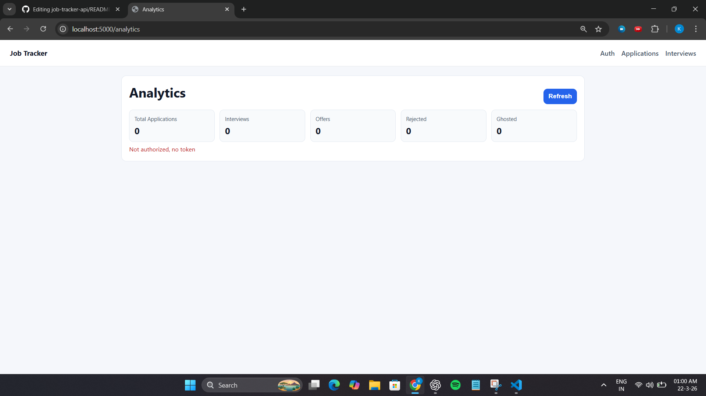
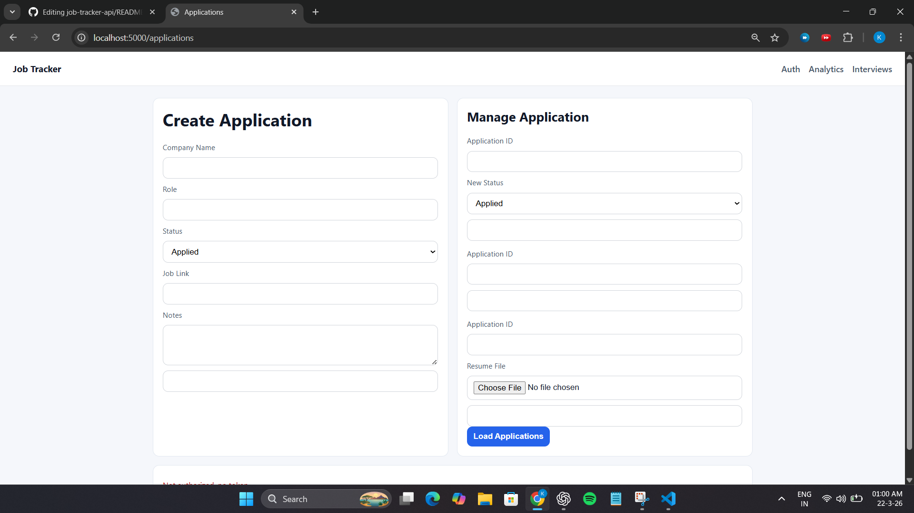
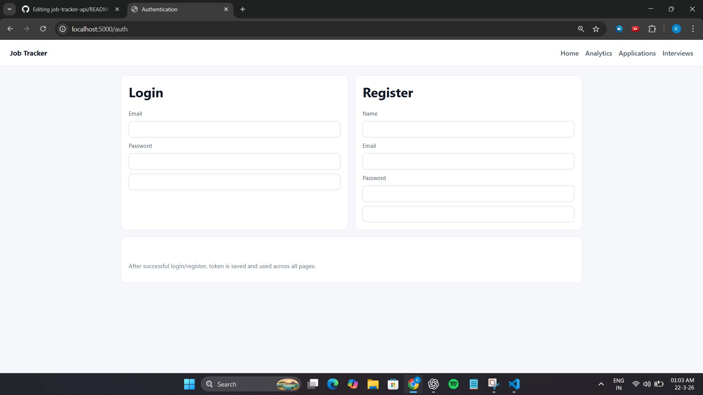
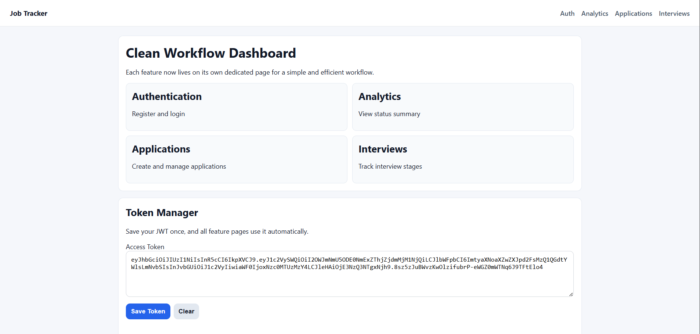
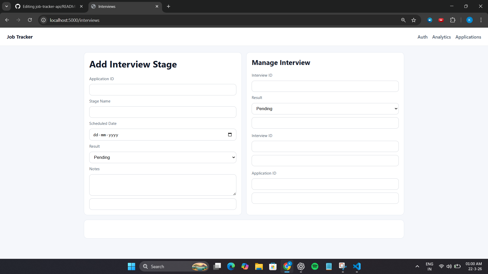

## ❗ Problem

Managing job applications across multiple platforms is messy and unstructured.

This system provides a centralized backend solution to track applications, monitor interview progress, and analyze outcomes efficiently.

# 🚀 Job Application Tracker API

A production-style backend system to manage job applications, track interview stages, and analyze progress.

---

## 🔗 Key Features

* 🔐 Secure JWT Authentication with password hashing (bcrypt)
* 📋 Full CRUD system for job applications
* 🔍 Filtering, Pagination, Sorting, and Search
* 📄 Resume Upload using Cloudinary + Multer
* 🧠 Analytics Dashboard using MongoDB Aggregation Pipeline
* 🎯 Interview Stage Tracking System
* ⚡ Rate Limiting for API protection
* 🛠 Centralized Error Handling Middleware
* 🚀 Optimized Queries using MongoDB Indexing

---

## ⚙️ Tech Stack

* Node.js
* Express.js
* MongoDB (Mongoose)
* JWT Authentication
* Cloudinary
* Multer

---

## 🏗 Architecture

Follows a modular backend architecture:

* Controllers → Business Logic
* Models → Database Schemas
* Routes → API Endpoints
* Middleware → Auth, Errors, Rate Limiting
* Utils → Token & Custom Error Handling

---

## 📡 API Endpoints

### Auth

* POST `/api/auth/register`
* POST `/api/auth/login`

### Applications

* POST `/api/applications`
* GET `/api/applications`
* PATCH `/api/applications/:id`
* DELETE `/api/applications/:id`

### Interviews

* POST `/api/applications/:id/interviews`
* GET `/api/applications/:id/interviews`

### Analytics

* GET `/api/analytics`

---
## 📦 Sample Response

GET /api/applications

```json
[
  {
    "companyName": "Google",
    "role": "Backend Intern",
    "status": "Interview",
    "createdAt": "2026-03-21"
  }
]
```
## 🛠 Run Locally

```bash
git clone <your-repo-link>
cd job-tracker
npm install
npm run start
```

Create a `.env` file using `.env.example`

---
## 📸 Preview

### Analytics Dashboard


### Applications Page


### Authentication Page


### Dashboard Home


### Interview Stages


## 📌 API Base URL

http://localhost:5000/api

---

## 👨‍💻 Author

Krishiv
